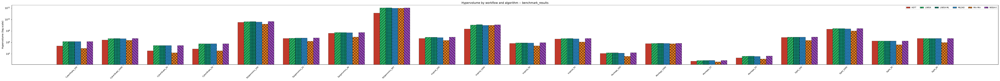
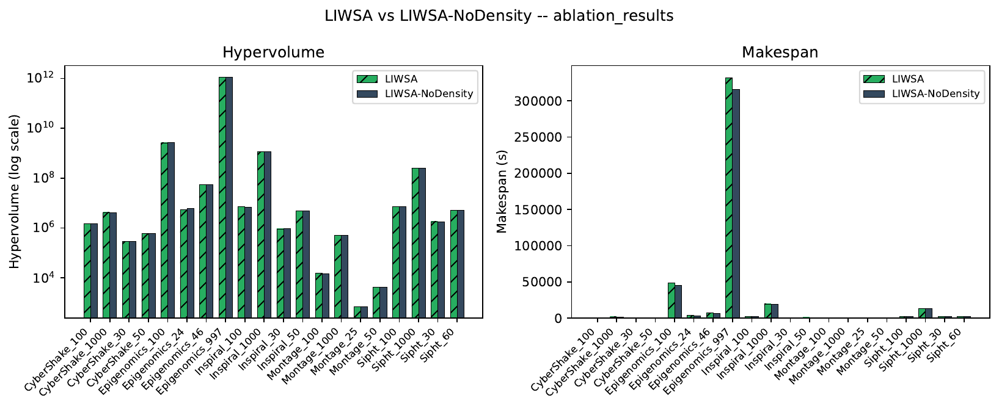
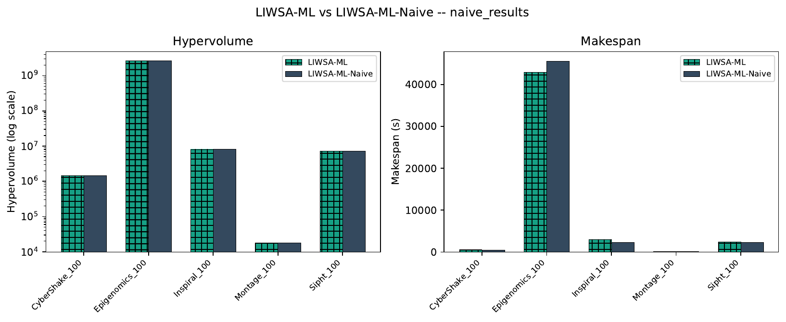
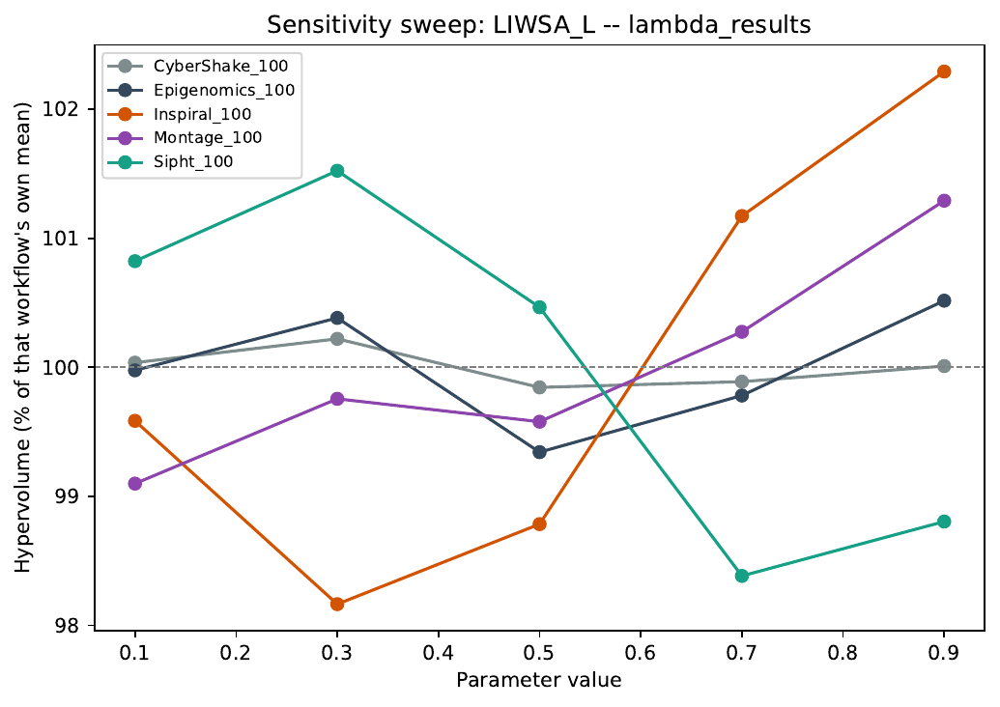

# 🦗 WorkflowSim — Locust-Inspired Workflow Scheduling

<p align="center">
  
  
  
  
  
  
</p>

<p align="center">
  <b>Density-Adaptive Locust Swarm Optimisation with Self-Supervised OLS Warm-Start<br>for Pareto-Optimal Cloud Workflow Scheduling</b><br>
  <i>Dr. Mohammed Alaa Ala'anzy — SDU University, Kazakhstan</i>
</p>

---

> *Desert locusts don't follow a timer. They respond to crowding. So does LIWSA.*

When individual locusts sense neighbours around them, they shift from solitary foraging to collective swarming — not because a clock told them to, but because of local density. **LIWSA** brings this exact mechanism into cloud workflow scheduling: each candidate schedule measures its own neighbourhood crowding at every generation and decides its own phase probability. No weight. No global clock. No scalar aggregation of makespan vs cost.

The result: a **true Pareto front** of scheduling options — not one solution, but a menu of makespan-vs-cost trade-offs — produced entirely inside WorkflowSim with zero external dependencies.

---

## 📁 Repository Structure

```
WorkflowSim_LocustModeling/
├── sources/org/workflowsim/planning/
│   ├── LIWSAPlanningAlgorithm.java          ← LIWSA (density-adaptive search)
│   ├── LIWSAMLPlanningAlgorithm.java        ← LIWSA-ML (OLS warm-start)
│   ├── NSGAIIPlanningAlgorithm.java         ← Standard NSGA-II baseline
│   ├── MLEAOPlanningAlgorithm.java          ← MLEAO baseline (2025 comparison paper)
│   └── HEFTPlanningAlgorithm.java           ← HEFT baseline
├── examples/org/workflowsim/examples/planning/
│   ├── LIWSAPlanningAlgorithmExample.java      ← LIWSA single-run example
│   ├── LIWSAMLPlanningAlgorithmExample.java    ← LIWSA-ML single-run example
│   ├── LIWSABenchmarkExample.java              ← Full 20-instance, 6-algorithm benchmark driver
│   ├── SensitivityAblationExample.java         ← Lambda/theta sweeps + OLS-vs-naive ablation
│   ├── MLEAOPlanningAlgorithmExample.java      ← MLEAO baseline example
│   ├── HEFTPlanningAlgorithmExample1.java      ← HEFT baseline example
│   ├── DHEFTPlanningAlgorithmExample1.java     ← DHEFT variant example
│   ├── HEFTBenchmark.java                      ← HEFT benchmark with metrics
│   ├── ParetoMetrics.java                      ← 2D hypervolume calculator
│   ├── ResultsCsvWriter.java                   ← Shared CSV output writer
│   └── RunMetricsCalculator.java               ← Shared metrics (all algorithms)
└── results/
    ├── generate_figures.py                     ← Figure generator for any results CSV
    ├── run_parallel.sh                         ← Safe process-level parallel batch runner
    └── *.csv                                   ← Benchmark, ablation, and sweep results
```

---

## 🧠 The Algorithms

### LIWSA — Locust-Inspired Workflow Scheduling Algorithm

Each candidate schedule is an integer vector `X = (x₁, …, xₙ)` assigning task `tₖ` to VM `vmₓₖ`. At every generation, each individual:

1. **Measures its local crowding density** `ρᵢ` — the fraction of population members within normalised Hamming distance `τ` (self-calibrated to the initial population's median pairwise distance, no hand-tuning needed).
2. **Decides its own phase probability** `p_soc = (1−λ)·t/T_max + λ·ρᵢ` — blending measured crowding with mild global annealing.
3. If **solitary** (`rand() > p_soc`): every other individual casts a signed, distance-weighted vote on each task's VM assignment. Better-ranked neighbours attract; worse-ranked ones repel. A softmax draw over the vote totals preserves diversity.
4. If **gregarious** (`rand() ≤ p_soc`): selects a partner from the elite set (the current Pareto front) via roulette weighted by proximity and front rank, then copies tasks probabilistically.
5. **Acceptance**: a child replaces its parent only if the parent does not strictly dominate the child — lateral moves to new non-dominated solutions are permitted.

Fitness is determined by **Pareto dominance** over makespan `M(X)` and execution cost `Γ(X)` — no weights, no normalisation.

### LIWSA-ML — OLS Warm-Start Extension

LIWSA-ML adds a pure-Java, zero-dependency warm-start that runs *inside* WorkflowSim before the main search:

1. **Sample** `Nₛ = 400` random genotypes and decode them through the simulation.
2. **Fit** two ordinary least-squares regressions (9×9 normal equations, solved via Gaussian elimination) predicting makespan and cost from a 9-dimensional (task, VM) feature vector: task length, topological level, fan-in/out, VM MIPS, cost rate, predicted duration, predicted cost, intercept — all normalised.
3. **Inject** `Nₚ = 4` OLS-biased seed genotypes covering different points on the makespan-cost trade-off axis, plus the actual HEFT and Min-Min schedules (via cloudlet-ID-keyed assignment maps), for 6 warm-start seeds total.
4. **Run LIWSA** from this biased initial population.

No TensorFlow. No PyTorch. No Python. One `.java` file.

### NSGA-II — Canonical Multi-Objective Baseline

A standard, faithful implementation (Deb et al., 2002): fast non-dominated sorting, crowding distance, and the crowded-comparison tournament are used exactly as originally specified. The one deliberate adaptation is uniform crossover and random-resetting mutation in place of simulated binary crossover and polynomial mutation, since neither is defined for this problem's categorical VM-index genes. It shares LIWSA's exact genotype, decoder, and warm-start seeding (see `Sec:Baselines` in the paper), so the comparison isolates search strategy from encoding effects.

---

## 📊 Key Results (20 Pegasus Benchmark Instances, 5 Families, 5 Seeds Each)

| Algorithm | Mean Hypervolume vs HEFT | Pareto Front Size | Search Wall-Clock (1000-task, relative to MLEAO) |
|-----------|-------------------------:|:------------------:|:----------------------------------------:|
| HEFT | baseline | 1 | — (no search phase) |
| Min-Min | −3.4% avg | 1 | — (no search phase) |
| MLEAO | +159.7% avg | 1–26 (mean 6.25) | 1.0× |
| LIWSA | +174.2% avg | 1–30 (mean 13.75) | 9.1× |
| **NSGA-II** | **+181.9% avg** | **1–30 (mean 26.84)** | **0.8×** |
| **LIWSA-ML** | **+182.9% avg** | **1–30 (mean 13.25)** | **13.2×** |

LIWSA-ML beats HEFT, Min-Min, and MLEAO clearly and consistently (mean hypervolume gain +9.1% over MLEAO). Against a standard NSGA-II baseline at matched search budget, encoding, decoder, and warm-start seeds, the picture is closer: NSGA-II wins mean hypervolume on 14/20 instances to LIWSA-ML's 5 (margins narrow, ~1.4% on average, not significant at n=5), while running 1.4×–13.5× faster depending on workflow size — traced to the O(P²n) cost of LIWSA's density-driven solitary-phase voting vs. NSGA-II's O(P²+Pn) operators.

On **data-intensive workflows** (Epigenomics, Inspiral at ~1000 tasks), LIWSA-ML simultaneously reduces makespan and cost versus HEFT (e.g. Epigenomics_997: −78.5% makespan, −10.0% cost) — true Pareto dominance, not a trade-off, and a pattern all four population-based algorithms (MLEAO, LIWSA, NSGA-II, LIWSA-ML) share to some degree since it stems from a structural HEFT weakness on large file transfers, not from any one algorithm's search strategy specifically.

<p align="center">
  <br>
  <sub><b>Fig. 1</b> — Mean hypervolume per workflow and algorithm (log-scaled, since values span orders of magnitude from 25-task to 1000-task instances). All four population-based algorithms (MLEAO, LIWSA, NSGA-II, LIWSA-ML) clear HEFT and Min-Min by a wide margin at every scale.</sub>
</p>

### Ablations and Sensitivity Analysis

| Experiment | Finding |
|---|---|
| **Density ablation** (`LIWSA` vs `LIWSA-NoDensity`, density fixed at 0.5) | No consistent advantage from *measuring* density: LIWSA wins 8/20 instances, mean −0.7% (NoDensity marginally ahead on average). The richer fronts vs. MLEAO come from having probabilistic phase mixing at all, not from that mixing being adaptive. |
| **λ sensitivity** (phase-mixing weight, swept 0.1–0.9) | Low sensitivity overall (mean range 2.2% of each workflow's own hypervolume) — robust, not fragile. Default λ=0.5 is not the best value tested, though: it ranks 4th–5th of 5 on 4/5 representative workflows. |
| **θ sensitivity** (softmax temperature, swept 0.1–0.9) | Low sensitivity overall (mean range 3.0%). Default θ=0.5 ranks 3rd of 5 on 4/5 workflows, a reasonable middle choice. Epigenomics shows zero variation (score gaps saturate the softmax regardless of temperature in this range). |
| **OLS vs naive features** (`LIWSA-ML` vs `LIWSA-ML-Naive`, raw duration/cost only, no learned weights) | No measurable advantage from the learned model: OLS wins 3/5 representative instances, mean −0.64% (naive marginally ahead), all p ≥ 0.19. |

Read together with the NSGA-II comparison: LIWSA-ML's aggregate advantage over HEFT/Min-Min/MLEAO is real and reproducible, but in controlled, like-for-like tests neither of the two specific refinements (adaptive density weighting, learned feature combination) is individually responsible for it. What both retain is architectural — a self-calibrating mechanism needing no manual per-workflow retuning — not a demonstrated performance edge over the simplest reasonable alternative.

<p align="center">
  
  <br>
  <sub><b>Fig. 2</b> — Left: LIWSA vs. LIWSA-NoDensity (density fixed at 0.5). Right: LIWSA-ML's learned OLS predictor vs. a naive duration/cost-only heuristic. Neither ablation shows a consistent edge for the more sophisticated mechanism.</sub>
</p>

<p align="center">
  <br>
  <sub><b>Fig. 3</b> — Phase-mixing weight λ swept from 0.1 to 0.9 on one representative instance per workflow family. Each curve is normalised to that workflow's own mean hypervolume: all five stay within roughly ±2% of their mean, showing the algorithm is not fragile to this parameter's exact value.</sub>
</p>

---

## 🔧 Shared Infrastructure

All algorithm drivers share the same supporting classes, so results are directly comparable without reconciling different column layouts or metric definitions:

**`RunMetricsCalculator`** — computes makespan, execution cost (using `CostModel.VM` per-second rates), average VM utilisation, Jain's fairness index, and scheduling speedup from the simulator's actual job results. One implementation, used by every driver.

**`ParetoMetrics`** — 2D hypervolume calculator with a shared cross-algorithm reference point. The reference point is computed once per workflow, across every algorithm being compared for that workflow, and reused — ensuring hypervolume comparisons are meaningful and not inflated by a single algorithm's own bad points. (This also means hypervolume values are only comparable *within* one CSV/comparator set, not across different CSVs — see the note in `results/README` below.)

**`ResultsCsvWriter`** — single CSV schema, flushed to disk after every completed run (not buffered to the end), so a long benchmark interrupted partway through still leaves every completed result safely on disk. Also provides `openAppend()` for batched/parallel runs that accumulate into one file.

```
workflow, algorithm, seed, makespan, cost, pareto_front_size, hypervolume,
avg_utilization_pct, fairness_index, speedup, search_wallclock_ms, sim_wallclock_ms
```

---

## ⚙️ VM Pool Configuration

The benchmark uses 16 heterogeneous VM instances (4 types × 4 each), spanning an 8× processing speed range and 6× cost range:

| Type   | MIPS | BW (Mbit/s) | $/s  | RAM    | Count |
|--------|-----:|------------:|-----:|-------:|------:|
| Micro  | 250  | 160         | 0.15 | 512 MB | 4     |
| Small  | 500  | 160         | 0.30 | 512 MB | 4     |
| Medium | 1000 | 160         | 0.60 | 512 MB | 4     |
| Large  | 2000 | 160         | 0.90 | 512 MB | 4     |

Scheduling uses `CloudletSchedulerSpaceShared`, no clustering, `FileSystem.LOCAL` replica catalog, 160 Mbit/s shared-fabric bandwidth.

---

## 🚀 Quick Start

**1. Clone and set up WorkflowSim 1.1.0 / CloudSim 3.0** as usual (already bundled in `sources/org/cloudbus`, no separate install needed).

**2. Compile:**
```bash
find sources examples -name "*.java" > sources.txt
javac -nowarn -cp "lib/*" -d bin @sources.txt
```

**3. Run the full benchmark** (20 workflows, 6 algorithms, 5 seeds, CSV output):
```bash
java -cp "bin:lib/*" org.workflowsim.examples.planning.LIWSABenchmarkExample
# Results written to: results/benchmark_results.csv (~17 min single-threaded)
```

**3b. Or run it in batches** (same output, useful for splitting across sessions or machines — each batch computes its own workflows' hypervolume reference point independently, so results are identical to a single full run):
```bash
java -cp "bin:lib/*" org.workflowsim.examples.planning.LIWSABenchmarkExample \
  "Montage_25,Montage_50,Montage_100" "results/my_run.csv"
```

**3c. Or run several batches in parallel** (process-level parallelism — see `results/run_parallel.sh` and the note below on why this is process-level, not thread-level):
```bash
./results/run_parallel.sh full       # full benchmark, 5 batches
./results/run_parallel.sh ablation   # density ablation, 5 batches
./results/run_parallel.sh lambda     # lambda sensitivity sweep
./results/run_parallel.sh theta      # theta sensitivity sweep
./results/run_parallel.sh naive      # OLS-vs-naive-features ablation
```

**4. Run the density ablation** (`LIWSA` vs `LIWSA-NoDensity`, all 20 instances):
```bash
java -cp "bin:lib/*" org.workflowsim.examples.planning.LIWSABenchmarkExample \
  "" "results/ablation_results.csv" "ablation"
```

**5. Run a sensitivity sweep or the naive-features ablation** (5 representative workflows, one per family, by default):
```bash
java -cp "bin:lib/*" org.workflowsim.examples.planning.SensitivityAblationExample lambda
java -cp "bin:lib/*" org.workflowsim.examples.planning.SensitivityAblationExample theta
java -cp "bin:lib/*" org.workflowsim.examples.planning.SensitivityAblationExample naive
```

**6. Generate figures from any results CSV:**
```bash
python3 results/generate_figures.py results/benchmark_results.csv
python3 results/generate_figures.py results/lambda_results.csv --sweep "LIWSA_L"
python3 results/generate_figures.py results/naive_results.csv --pair "LIWSA-ML,LIWSA-ML-Naive"
```
Figures are saved as PDFs under `results/figures/`. Hypervolume is plotted on a **log-scaled** y-axis by default — do not change this back to linear without splitting small- and large-scale instances into separate panels, or small-scale bars will visually disappear next to 1000-task instances (this happened once already; see the paper's Fig. 2 for the fix).

**7. Run the HEFT baseline standalone:**
```bash
java -cp "bin:lib/*" org.workflowsim.examples.planning.HEFTBenchmark
```

### On parallelism and reproducibility

`run_parallel.sh` runs independent batches as **separate JVM processes**, not threads within one JVM. This is a hard requirement, not a stylistic choice: CloudSim keeps its entity list and simulation clock in `private static` fields (global, JVM-wide state), so two `CloudSim.init()`/`startSimulation()` cycles running concurrently *on threads in the same JVM* would silently corrupt each other's state. Separate processes each get their own JVM and their own copy of that static state, so this is safe. Every individual (workflow, algorithm, seed) run's own output is unaffected by parallelism either way — its Random instance and CloudSim lifecycle are already fully self-contained — so running in parallel changes wall-clock time only, never any reported result.

---

## 📐 Algorithm Parameters

| Parameter | Value | Scope |
|-----------|------:|-------|
| Population size `P` | 30 | MLEAO, LIWSA, NSGA-II, LIWSA-ML |
| Generations `T_max` | 100 | MLEAO, LIWSA, NSGA-II, LIWSA-ML |
| Random seeds | 5 (1–5) | MLEAO, LIWSA, NSGA-II, LIWSA-ML |
| Neighbourhood radius `τ` | self-calibrated | LIWSA, LIWSA-ML |
| Phase-mixing weight `λ` | 0.5 (swept 0.1–0.9, see above) | LIWSA, LIWSA-ML |
| Kernel parameters `F, L` | 3.0, 0.3 | LIWSA, LIWSA-ML |
| Solitary resampling prob. `η` | 0.5 | LIWSA, LIWSA-ML |
| Copy scale `α` | 1.2 | LIWSA, LIWSA-ML |
| Min elite `δ_min` | 3 | LIWSA, LIWSA-ML |
| Mutation rate `µ` | 0.02 | MLEAO, LIWSA, LIWSA-ML |
| NSGA-II crossover prob. `p_c` | 0.9 (uniform) | NSGA-II only |
| NSGA-II mutation prob. `p_m` | 1/n (random-reset) | NSGA-II only |
| OLS training samples `Nₛ` | 400 | LIWSA-ML only |
| OLS seed genotypes `Nₚ` | 4 | LIWSA-ML only |
| Softmax temperature `θ` | 0.5 (swept 0.1–0.9, see above) | LIWSA-ML only |
| `CONFIG_DENSITY_ABLATION` | `false` (set `true` to ablate) | LIWSA only |
| `CONFIG_NAIVE_FEATURES` | `false` (set `true` to ablate) | LIWSA-ML only |

None of these were tuned via a held-out validation set distinct from the 20 evaluation instances; see the paper's Methodology section for the honest account of this limitation and the sensitivity/ablation results above as a partial check.

---

## 📚 Workflow Benchmark Suite

20 instances from the [Pegasus Workflow Gallery](https://pegasus.isi.edu/), across 5 scientific families at 4 scale points each (24–1000 tasks):

| Family | Scale Points | Type | Characteristic |
|--------|-------------|------|----------------|
| Montage | 25, 50, 100, 1000 | Compute-bound | Wide, flat DAG; astronomical image mosaic |
| CyberShake | 30, 50, 100, 1000 | Compute-bound | Wide, flat DAG; seismic hazard simulation |
| Sipht | 30, 60, 100, 1000 | Chain-heavy | Deep sequential chains; critical-path sensitive |
| Epigenomics | 24, 46, 100, 997 | Data-intensive | Inter-task transfers up to 5.3 GB |
| Inspiral | 30, 50, 100, 1000 | Data-intensive | Gravitational wave detection; multi-GB file transfers |

The sensitivity sweep and OLS-vs-naive ablation (above) use the 100-task scale point from each family as a representative, structurally-diverse subset, to keep sweep cost manageable while still testing across five different DAG topologies.

---

## 📄 Paper

> **Density-Adaptive Locust Swarm Optimisation with Self-Supervised OLS Warm-Start for Pareto-Optimal Cloud Workflow Scheduling**  
> Dr. Mohammed Alaa Ala'anzy  
> *IEEE Transactions on Cloud Computing* (submitted)

Full numerical results for all 20 workflow instances, plus the ablation and sensitivity sweep CSVs, are available in the [`results/`](https://github.com/Al3nzy/WorkflowSim_LocustModeling/tree/master/results) directory.

---

## 📜 License

Copyright 2025–2026 SDU University, Kazakhstan.  
Licensed under the [Apache License, Version 2.0](http://www.apache.org/licenses/LICENSE-2.0).

---

<p align="center">
  Built on <a href="https://github.com/WorkflowSim/WorkflowSim-1.0">WorkflowSim 1.1.0</a> and <a href="https://github.com/Cloudslab/cloudsim">CloudSim 3.0</a>.<br>
  Benchmark traces from the <a href="https://pegasus.isi.edu/workflow_gallery/">Pegasus Workflow Management System Gallery</a>.
</p>
